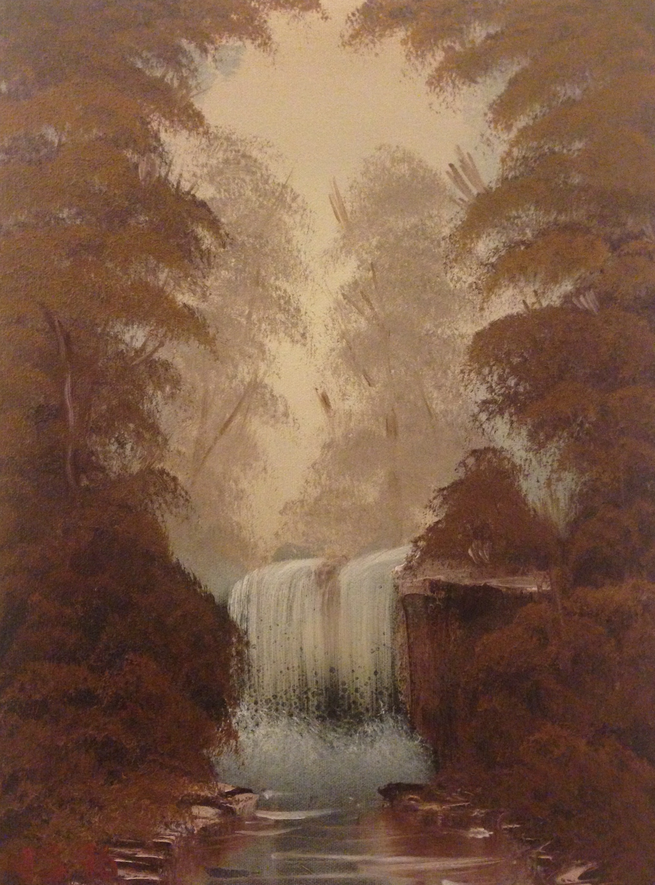

I'm a Software Engineer in NYC ([resume](../resume))

I'm always involved in many projects, be it open-source software for the
benefit of the greater good, or technology for new business ventures.
See my [GitHub](http://github.com/jschementi) profile for all my open-source
projects. Please <noscript>contact me</noscript> for any questions.

<!---
## Moven

I oversee the design and engineering of <a href="http://moven.com" target="_blank">Moven</a>,
an app that helps you manage your money as you spend it.

Get the app for
<a href="https://itunes.apple.com/us/app/moven/id661035659" target="_blank">iPhone</a>
or
<a href="https://play.google.com/store/apps/details?id=com.movencorp.moven" target="_blank">Android</a>,
and please apply for an account. It's free!
-->

## Speaking & Writing

While most of my time is spent figuring out what to build, and building it, I
also write (outside of this website) and speak about open-source or technical
subjects; occasionally about the product I'm currently working on.

I've compiled a list of all the publications or talks I've done. If you find my
mug somewhere else on the internet, let me know!

<ul>
  <li><a href="/talks">Speaking & Writing</a></li>
</ul>

## Iron Languages

From 2007-2011 I was an active core team member of the Iron-Languages project;
the implementation of the Ruby and Python programming language for the
Microsoft.NET and Mono frameworks. I've worked on various parts of the project,
from engineering to evangelism.

<ul>
  <li><a target="_blank" href="http://ironruby.net" target="_blank">IronRuby homepage</a></li>
  <li><a target="_blank" href="http://ironpython.net" target="_blank">IronPython homepage</a></li>
  <li><a target="_blank" href="http://dlr.codeplex.com" target="_blank">Dynamic Language Runtime</a></li>
</ul>

While IronPython development has picked back up after Microsoft stopped funding
in 2010, IronRuby has been fairly dormant since then. If anyone would like to
become the new maintainer of IronRuby, please
<noscript>contact me</noscript>.

## ASSISTments

During my masters work at WPI, I worked at the AI Lab on <a target="_blank"
href="http://assistments.org">ASSISTments</a>, a web-based intelligent tutor.
My role was more pragmatic than research oriented, mainly on redesigning
ASSISTments to the user experience and technical architecture it has today.
Though I'm no longer involved in the project, I'm happy to see the current team
continuing to do awesome work, and I strongly suggest you evaluate it for your
educational organization, your children, or even if you want to brush up on
your math skills.

## Photos

I take lots of photos between my <a target="_blank" href="http://www.flickr.com/cameras/nikon/d90/">Nikon D90</a> and my <a target="_blank" href="http://www.flickr.com/cameras/apple/iphone_5/">iPhone 5</a>, and post everything on <a target="_blank"  href="http://www.flickr.com/photos/jschementi/">Flickr</a>. Select shots are posted to <a target="_blank" href="http://instagram.com/jschementi">Instagram</a>.

## Music

Hobbiest guitarist, singer, song-writer. Here are some of my songs:

- [soundcloud.com/jschementi](https://soundcloud.com/jschementi)

And this gives you an idea of what type of music I listen to:

- [last.fm](http://www.last.fm/user/jschementi)

## Art

I used to paint and draw a lot - mostly landscapes. Here are a few of my favorites:

